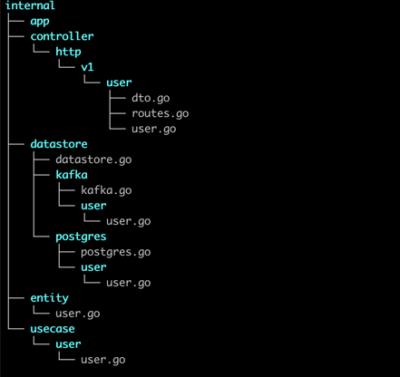

## Run 
**From root project directory:** `docker-compose  --project-directory ./ -f deployments/docker-compose.yml up`

## Assumptions 
* This service won't get too big, midsize microservice, without many API methods.
* It is not highload. 

## Principles
* KISS
* DRY
* YAGNI.
* Avoid premature optimisations.
* SOLID
* Flat structure/[fewer, larger packages](https://dave.cheney.net/practical-go/presentations/qcon-china.html#_consider_fewer_larger_packages)(based on the assumption: "This service won't get too big" )

Almost all principles, but SOLID are about time saving. 

## DB related choices
* I've used gorm(ORM instead driver), since it is not highloaded service + save development time for standard CRUD API methods.

In real microservice(not api with hundreds of methods), my choice will be driver + sugar syntax somewhere.

**Examples**: sqlx, pgxv5, [scanny](github.com/georgysavva/scany), etc

**Reasoning behind that**: performance and control, less chances to make mistake if team are good with SQL.  
Gorm feature like a "Preload" can shut down production with panic in a second or consume whole pod memory because of reflection.

* Password is stored as is(no hash). It is treated as any string field. For the sake of time.

## HTTP libs/routers
1. For highly loaded service I would choose fasthttp server + route.
1. Since go 1.22 httpServerMux becomes [better](https://go.dev/blog/routing-enhancements).
   Thanks to wildcard and method matching. Sufficient for this task.
1. gorillaMux/echo/go-chi:
* simple and compatible with net/http.
* syntax sugar
* quite broad functionality.
 
__My choice:__ echo, syntax sugar might save some time.
## Architecture approach
* I used 3 layers:
  -  transport/controller/handler
  -  business/service/usecase/interactor,
  -  repository/datastore/storage/persistence.
* Since it is midsize project, I avoided strongly nested project structure. (according to principles section).

**Cons**: packages can get to big, naming problem(Can't name each Handler just "Handler")

There is an example of how it could be implemented for project of bigger size. 

* There are a lof of options and opinions how to organise these layers.
The best choice is to follow current approach within the team.

**Maximum level of isolation**:one structure for logic within layer + one for passing to the next layer + one structure for external output/input.
**My choice**: isolate business layer without additional structures where is possible, in order to be able easily replace controller or datastore layer.

## Validation explanation 
* My ID field is string till repository level, it looks a bit unusual at first glance. 
**_The idea is_**: UUID it is about how to store this column, not about business logic.
In other database it can be just string with id generation in app.  
* Other validations were omitted.

## API
* Create - all fields except ID, updated_at and created_at.
* Update - all fields should be passed, otherwise they will be set empty.

## Logs
* In most cases didn't add any input params to logs for the sake of simplicity.
  In production, it should be clear what input caused error.

## Notifications 
There was a question in task description: _Asynchronous communication: - Is it asynchronous?_
It raises two questions:
1. What action is anticipated for an error during notification push?
1. Why I can't use just message broker? Even without async code, from my point of view, it would be quite sufficient solution.

There are two options for async code there:
1. WaitGroups for multiple notificators.
2. pubsub/producer-consumer pattern with buffered channel.
 * User service writes to the channel 
 * in endless loop notificator consumes that and send to repositoryNotificator.

**My choice**: I implemented both, but used pubsub approach. Less waiting time, but in the worst case more notifications will be lost.
I can afford not to close channel. Since I have multiple writers and channel exists till the end of program. 
Also, it is unnecessary complexity for test task.

**Note**: errGroup approach is not covered by tests.

Final solution strongly rely on the task. In current task, any approach will be sufficient. 

## Healthcheck
* I implemented simple solution. 
Since in production there is a not zero probability to have hundreds of repo/services, certainly health status should be collected in background.
* My postgres healthcheck implies one postgres for all repositories, certainly, it is easy to change. 

## Improvements
* [easyjson](https://github.com/mailru/easyjson) library can give speed boost with json marshalling.
* Add integration tests.
* Test whole webserver(with router), not only handler.
* Add comments to code, according to effective go. 